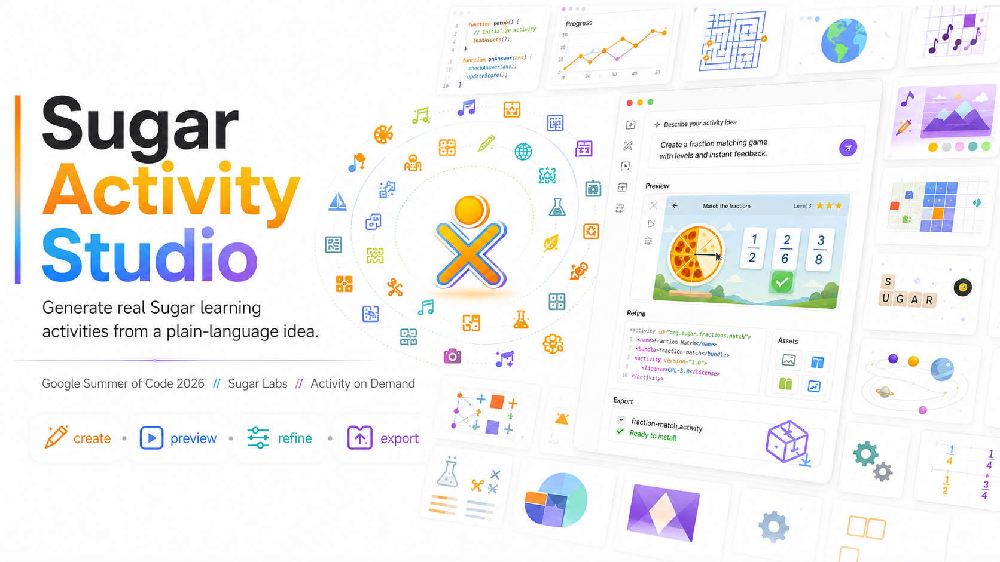

<p align="center">
  
</p>

<h1 align="center">Sugar Activity Studio</h1>

<p align="center">
  <b>Describe a learning activity in plain words — get a real, installable Sugar activity.</b><br>
  Create &nbsp;·&nbsp; Preview &nbsp;·&nbsp; Refine &nbsp;·&nbsp; Export
</p>

<p align="center">
  <i>Google Summer of Code 2026 · Sugar Labs · Activity on Demand</i>
</p>

---

Sugar Activity Studio is the standalone desktop app for **Activity on
Demand**: an AI-assisted studio that turns a learner's or teacher's idea
("a fraction matching game with levels and instant feedback") into a
complete [Sugar](https://sugarlabs.org) activity — planned, coded,
validated, live-previewed, and packaged as an installable `.xo` bundle.
It runs on any Linux desktop, **no Sugar shell required**.

## Features

- **Sugar-style home** — opens on your XO icon (in your own colors) with
  every activity you have generated ringed around it, using the same
  ring/spiral geometry as the Sugar shell. Click an icon to play it;
  hover or right-click for **Open** / **Modify**.
- **Plain-language creation** — pick a learning area, describe the idea,
  press Send. A ✨ **Enhance** button (and automatic enhancement for
  short prompts) expands rough ideas into a detailed brief the AI can
  build correctly — and the chat shows you the brief it understood, so
  you learn what a strong prompt looks like.
- **Grounded generation** — the pipeline retrieves patterns from real
  installed Sugar activities (local RAG, no uploads or training), plans
  with your chosen model, generates `activity.py`, and validates it
  (syntax, Sugar API misuse, import safety, request match) with
  automatic retry-and-fix rounds.
- **Live preview** — the generated activity runs embedded in the studio.
  Click any part of the preview and describe a change; refinements are
  applied as minimal patches with full version history.
- **Review & versions** — read the generated code with syntax
  highlighting, inspect the plan, and hop between revisions.
- **Export & install** — one click packages an `.xo` bundle, exports
  buildable Flatpak sources, or installs to `~/Activities` and launches
  the activity immediately via `sugar-activity3`.
- **Safe by design** — generated code is sandboxed by an import/call
  allowlist, may not touch the network or filesystem APIs, and every
  failure path degrades gracefully.

## Requirements

The GTK stack comes from your distribution, not PyPI:

| Requirement | Why |
|---|---|
| Python ≥ 3.8 | the app itself |
| GTK 3 + PyGObject (`python3-gi`, `gir1.2-gtk-3.0`) | the UI |
| Sugar toolkit (`python3-sugar3`, `sugar-toolkit-gtk3`) | Sugar widgets, `.xo` packaging, the `sugar-activity3` launcher |
| *(optional)* `sugar-artwork` themes | authentic Sugar look; degrades gracefully without |

On Debian/Ubuntu:

```sh
sudo apt install python3-gi gir1.2-gtk-3.0 python3-sugar3 sugar-toolkit-gtk3
```

> The studio depends on the Sugar **toolkit as a library** (the way any
> GTK app depends on GTK). It does **not** need the Sugar desktop
> installed or running.

## Setup & run

### From a checkout (no install)

```sh
git clone https://github.com/Ashutoshx7/sugar-aod-studio.git
cd sugar-aod-studio
python3 bin/sugar-aod-studio        # or: python3 -m aodstudio
```

### Installed

```sh
pip install .
sugar-aod-studio
```

### Connect an AI model

Open the create page and use the **provider selector** next to the
prompt box: choose a provider, paste your API key, Save. Keys are
stored locally in your profile and never leave your machine except to
call the provider you chose.

Supported providers: **OpenRouter** (default model
`anthropic/claude-opus-4.8`), **Gemini**, **OpenAI**, **Claude**,
**DeepSeek**, **Qwen**, **Moonshot**, **Ollama** (local, no key), and a
keyless **local template** mode for trying the flow offline.

Model choices can be overridden per provider with environment
variables (`AOD_OPENROUTER_MODEL`, `AOD_GEMINI_MODEL`,
`AOD_OLLAMA_MODEL`, …), and `AOD_LLM_PROVIDER` sets the default
provider.

## Using the studio

1. **Home** — everything you've made, around your XO. Click to play,
   right-click → *Modify* to keep working on one, or **Create new**.
2. **Create** — pick a learning area, type your idea. Press
   **✨ Enhance** to expand it into an editable brief, or just Send —
   short prompts are enhanced automatically (toggle: *Enhance
   Auto/Off*).
3. **Studio** — watch the generation progress, then explore the
   **Preview / Review / Versions** tabs. Click a part of the live
   preview and describe a change, or chat a refinement — each one
   becomes a new version.
4. **Ship it** — *Export XO*, *Export Flatpak*, or *Install & Open* to
   put it in `~/Activities` and play it instantly.

## Where things live

- Projects, sessions, jobs, and API keys: `~/.sugar/default/aod/`
  (shared with a Sugar shell install, if you have one — activities
  generated here appear there too).
- Installed activities: `~/Activities/`.

## Development

```sh
python3 -m pytest tests/ -q     # 150 tests: pipeline, providers, UI smoke
python3 -m flake8 aodstudio/
```

Layout: `aodstudio/model/` is the shell-free backend (planning, RAG,
LLM providers, code generation, validation, packaging, sessions);
`aodstudio/ui/` is the GTK front end (`panel.py` hosts the whole
studio, `window.py` wraps it); `bin/sugar-aod-studio` is the launcher.
A test enforces that no `jarabe` (Sugar shell) module is ever imported.

## Provenance

Extracted from the `aod-activity-on-demand` branch of the
[Sugar shell fork](https://github.com/Ashutoshx7/sugar), where the same
experience also runs embedded in the Sugar home view. The home ring
layout is ported from Sugar's `favoriteslayout.py`.

## License

GPL-3.0-or-later, same as Sugar. See [LICENSE](LICENSE).
